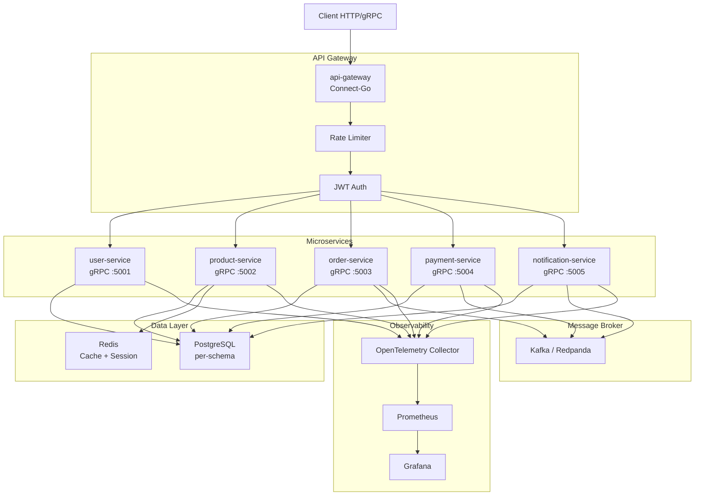

# Go E-Commerce

Go e-commerce backend with microservices, gRPC, Kafka, OpenTelemetry, and Clean Architecture.

## Architecture



| Service | Responsibility | Tech |
|---------|---------------|------|
| **api-gateway** | Routing, JWT auth, rate limiting | Connect-Go |
| **user-service** | Registration, auth, profiles, roles | gRPC + PostgreSQL |
| **product-service** | Catalog, categories, inventory | gRPC + PostgreSQL + Redis |
| **order-service** | Cart, orders, saga orchestrator | gRPC + PostgreSQL + Kafka (producer) |
| **payment-service** | Mock payment gateway, idempotency | gRPC + PostgreSQL |
| **notification-service** | Async notifications (mock email) | Kafka consumer + PostgreSQL |

## Stack

| Layer | Technology |
|-------|-----------|
| **Language** | Go 1.26+ |
| **Protocol** | Connect-Go (unified gRPC + HTTP/JSON) |
| **Messaging** | Apache Kafka (Redpanda in dev) |
| **Databases** | PostgreSQL + Redis |
| **Observability** | OpenTelemetry → Prometheus → Grafana |
| **Cache** | Redis (session, rate-limit, product cache) |
| **Container** | Docker multi-stage (linux/arm64) |
| **Orchestration** | Kubernetes (OCI Ampere) + Helm |
| **CI/CD** | GitHub Actions |

## Clean Architecture

Each service follows Clean Architecture with clear layer separation:

```
service/
├── cmd/server/
│   └── main.go              # Entry point, DI, graceful shutdown
├── internal/
│   ├── entity/              # Enterprise business rules
│   ├── usecase/             # Application business rules
│   ├── repository/          # Persistence interfaces
│   │   └── postgres/        # Concrete implementation with sqlc
│   ├── delivery/            # Transport layer (gRPC handlers)
│   └── presenter/           # Response formatting (DTOs)
├── migrations/              # Versioned database migrations
└── Dockerfile
```

### Layer Dependencies

```
Entity ← Usecase ← Delivery (gRPC)
                  ↓
              Repository (interface)
                  ↓
              Postgres (implementation)
```

- **Entity** depends on nothing external
- **Usecase** depends on interfaces (dependency inversion)
- **Repository** is defined as an interface in the domain, implemented in infrastructure

## Order Flow (Orchestrated Saga)

```
Client → api-gateway → order-service
                            │
                    ┌───────┼───────┐
                    ▼       ▼       ▼
              payment  product   Kafka
              -service -service   (order.confirmed)
                                     │
                                     ▼
                              notification-service
```

1. Client creates order → `order-service` (status: PENDING)
2. `order-service` calls `payment-service` (synchronous gRPC)
3. `payment-service` processes simulated payment with idempotency
4. If approved: `order-service` reserves inventory via `product-service`
5. If all good: publishes `order.confirmed` to Kafka
6. `notification-service` consumes and sends mock email
7. On failure at any step: saga compensates with rollback

## Prerequisites

- Go 1.26+
- Docker + docker-compose
- Buf CLI (`brew install buf`)
- kubectl + Helm (for K8s deploy)

## Local Development

```bash
# Start dependencies (Postgres, Redis, Kafka)
make docker-up

# Run all service migrations
make migrate-up

# Develop a specific service (hot-reload with air)
make dev-user
make dev-product
make dev-order

# Run all services locally
make docker-up-all

# Tests
make test
make test-integration

# Generate proto code
make gen
```

## Available Commands

```bash
make docker-up       # Start infrastructure (Postgres, Redis, Kafka)
make docker-down     # Tear down infrastructure
make dev-<service>   # Start service in dev mode (hot-reload)
make test            # Run unit tests
make test-integration # Run integration tests
make gen             # Generate proto code with Buf
make migrate-up      # Run pending migrations
make build-all       # Build all Docker images
make lint            # Lint (golangci-lint)
```

## Deploy (OCI Ampere)

```bash
# Build ARM64 images
make docker-build SERVICE=user-service

# Deploy to K8s
helm upgrade --install user-service deploy/helm/user-service \
  --namespace ecommerce --create-namespace
```

## Roadmap

- [x] Proto definitions (Buf + Connect-Go)
- [ ] User service (JWT auth, CRUD)
- [ ] API Gateway
- [ ] Product service (catalog + inventory)
- [ ] Order service (cart + saga orchestrator)
- [ ] Payment service (mock + idempotency)
- [ ] Notification service (Kafka consumer)
- [ ] OpenTelemetry end-to-end tracing
- [ ] Helm charts + GitHub Actions
- [ ] Deploy to OCI Ampere K8s

## License

MIT